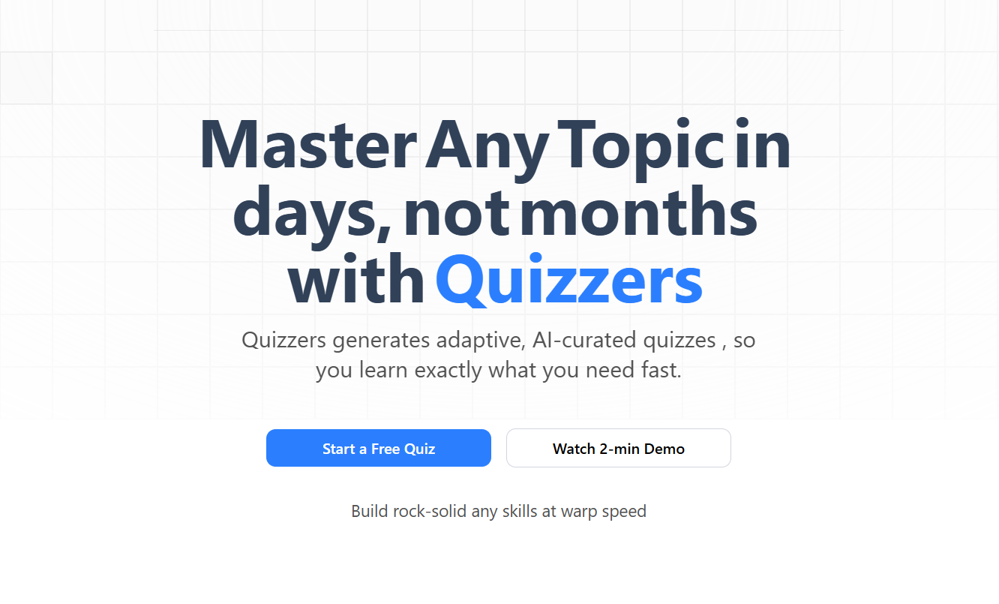

# Quizzers

Quizzers is an adaptive, AI-powered quiz platform built with Next.js. It generates personalized quizzes to help you master any topic quickly. Powered by Google Gemini AI, it pinpoints your weak spots so you learn exactly what you need, fast.



## Features
- Start a free quiz on any topic
- AI-curated, adaptive quizzes
- Multiple-choice questions with explanations
- Fast, modern UI
- Login and demo options
- Built with Next.js, Tailwind CSS, and Google Gemini API

## Getting Started

1. **Install dependencies:**
   ```bash
   bun install
   # or
   npm install
   # or
   yarn install
   # or
   pnpm install
   ```

2. **Set up your Google Gemini API key:**
   - Create a `.env.local` file in the root directory.
   - Add your API key:
     ```env
     GEMINI_API_KEY=your_google_gemini_api_key_here
     ```

3. **Run the development server:**
   ```bash
   bun dev
   # or
   npm run dev
   # or
   yarn dev
   # or
   pnpm dev
   ```

4. **Open [http://localhost:3000](http://localhost:3000) in your browser.**

## Usage
- Click "Start a Free Quiz" to begin.
- Enter any topic (e.g., "React", "JavaScript", "Next.js").
- The app generates a quiz with 10 multiple-choice questions.
- View explanations and answers after submission.

## Tech Stack
- Next.js
- Tailwind CSS
- Google Gemini AI API
- Bun (optional)

## Customization
- Edit quiz logic in `src/components/inputForQuizzes.jsx`.
- Update UI in `src/components/` and `src/app/`.

## Deployment
Deploy easily on [Vercel](https://vercel.com/) or your preferred platform.

## License
MIT

---

*Made with ❤️ by Sammed Chougule*
